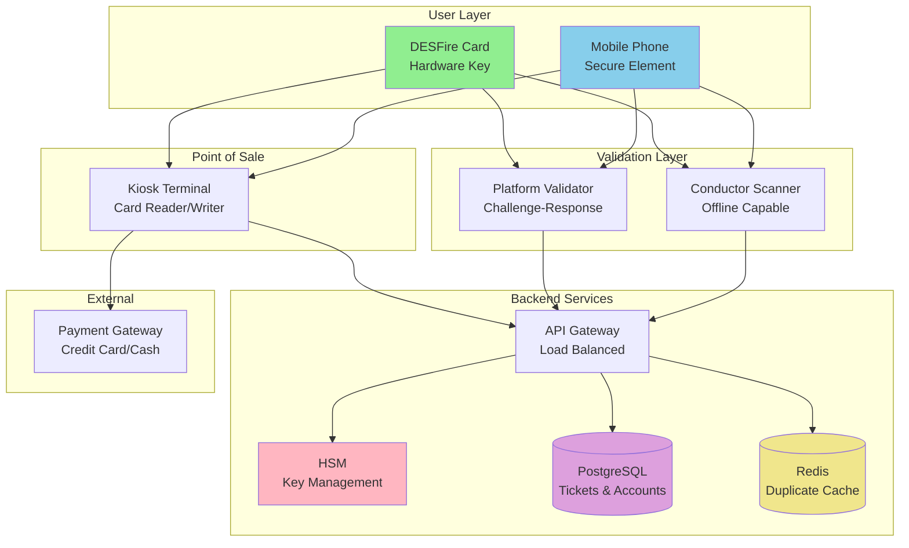
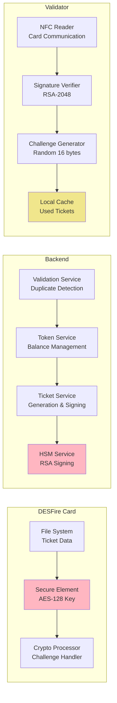
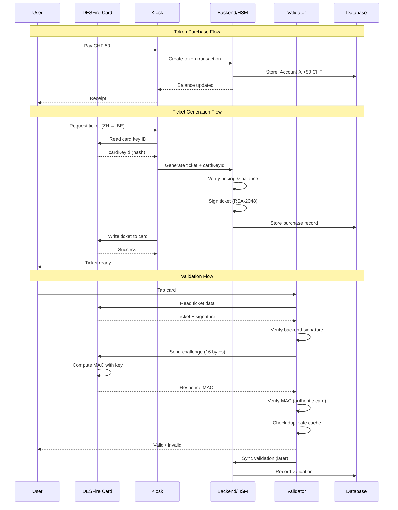
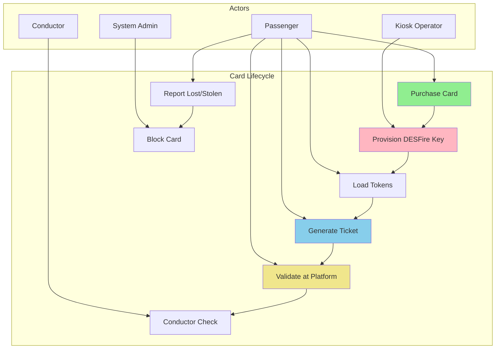
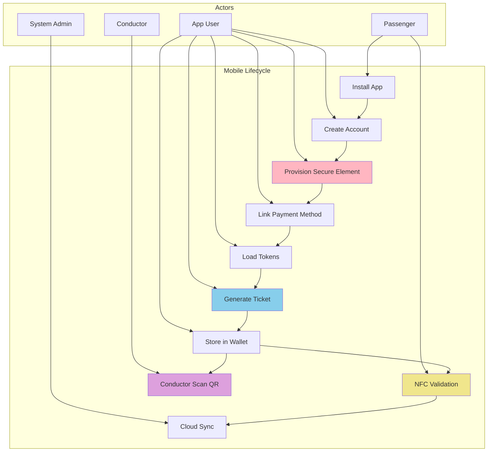
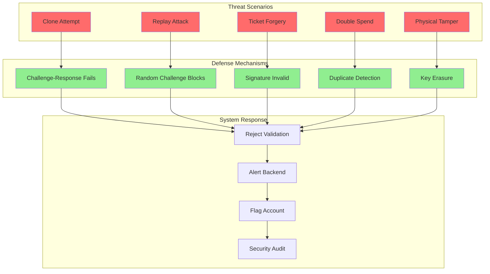

# System Architecture

Complete technical specification for a digital ticketing system using DESFire smart cards and smartphone validation.

## Table of Contents

1. [System Overview](#system-overview)
2. [Architecture Diagrams](#architecture-diagrams)
3. [Use Case Diagrams](#use-case-diagrams)
4. [Core Components](#core-components)
5. [Token-Based Flow](#token-based-flow)
6. [Signature Protocol](#signature-protocol)
7. [Validator Operations](#validator-operations)
8. [Privacy Model](#privacy-model)
9. [Storage Schema](#storage-schema)
10. [Security Considerations](#security-considerations)

---

## System Overview

### Design Philosophy

**Core Value Proposition**: Replace paper tickets with digital proof-of-payment using conductor-only validation (no expensive platform barriers).

**Key Advantages:**
- ✅ **Low Infrastructure Cost**: Conductors validate using smartphones (no gates/barriers needed)
- ✅ **Clone-Proof Hardware**: DESFire EV3 cards with challenge-response authentication
- ✅ **Offline-First**: Validators work without network connectivity
- ✅ **Privacy-Preserving**: Conductors see route/class but not personal information
- ✅ **Flexible Deployment**: Three options (smartphone app, DESFire card, hybrid)

### Architecture Principles

1. **Clone-Proof Hardware**: DESFire EV3 smart cards with AES-128 challenge-response
2. **Conductor Validation**: All validation done by conductors with smartphones (no platform barriers)
3. **Offline-First**: Validators work without network, sync periodically
4. **Multi-Layer Security**: Hardware keys + backend signatures + duplicate detection + expiration checks
5. **Token-Based Privacy**: Payment method separated from travel using generic credits
6. **Phased Deployment**: Start with Android-only (€50K), expand to iOS + kiosks (€200K), optionally add platform validators (€500K)

### Deployment Options

**Phase 1: Android-Only (€50K)**
- Android app for in-app purchases and phone-to-card NFC credit transfer
- Pre-provisioned DESFire cards (€5 each)
- Conductor smartphones with validation app
- Backend API (AWS/Azure)

**Phase 2: iOS + Kiosks (€200K)**
- iOS app with Secure Enclave integration
- Self-service kiosks at major stations
- Expanded card inventory

**Phase 3: Platform Validators (€500K, Optional)**
- Platform-based NFC readers for high-traffic stations
- Real-time monitoring dashboards
- Automated fare enforcement

### Privacy Model

**⚠️ This is NOT full anonymity. Backend can track per-account travel history.**

**What conductors see:**
- ✅ Route and travel class (required for verification)
- ✅ Validity status (valid/expired/already used)
- ✅ Ticket type (single/day pass)

**What conductors CANNOT see:**
- ❌ User name or personal information
- ❌ Payment method used
- ❌ Token balance remaining
- ❌ Purchase history or travel patterns

**What backend knows:**
- Account X purchased tokens (payment info)
- Account X generated ticket for route Y (travel intent)
- Ticket Y validated at location Z (delayed sync from validators)
- Backend CAN build per-account travel history

**Privacy trade-off**: Backend has travel data, but conductors remain anonymous to users (no tracking by individual conductor).

### System Actors

```
┌─────────────┐
│   Kiosk     │  → Token sales + ticket generation
└─────────────┘
       │
       ↓
┌─────────────┐
│ User Device │  → Card/phone with tickets
└─────────────┘
       │
       ↓
┌─────────────┐
│  Validator  │  → Platform entrance/conductor scanner
└─────────────┘
       │
       ↓
┌─────────────┐
│   Backend   │  → Central server (HSM, database)
└─────────────┘
```

### Technology Stack

**Frontend (Demo):**
- React 18 + Vite 5 + Tailwind CSS
- IndexedDB (Dexie.js)
- BroadcastChannel API (cross-tab sync)

**Backend (Production):**
- Node.js / Java / Go
- HSM (AWS CloudHSM / Azure Key Vault)
- PostgreSQL + Redis
- REST API + WebSocket

**Cryptography:**
- DESFire EV3: AES-128 challenge-response (hardware-protected keys)
- Backend: RSA-2048 digital signatures (NOT blind signatures)
- Hashing: SHA-256
- Transport: TLS 1.3 with certificate pinning

---

## Architecture Diagrams

### System Architecture



### Component Architecture



### Data Flow Architecture



---

## Use Case Diagrams

### Physical NFC Card Use Cases



### Detailed Physical Card Use Cases

```mermaid
graph LR
    subgraph "UC1: Purchase & Provision Card"
        A1[User pays CHF 5]
        A2[Kiosk dispenses card]
        A3[Generate unique AES key]
        A4[Write key to card]
        A5[Store keyID in backend]
        A6[Card activated]
    end
    
    subgraph "UC2: Load Tokens"
        B1[User selects amount]
        B2[Payment processed]
        B3[Backend credits account]
        B4[Kiosk displays balance]
    end
    
    subgraph "UC3: Generate Ticket"
        C1[User selects route]
        C2[Kiosk reads cardKeyId]
        C3[Backend creates ticket]
        C4[Backend signs ticket]
        C5[Kiosk writes to card]
        C6[Deduct tokens]
    end
    
    subgraph "UC4: Platform Validation"
        D1[User taps card]
        D2[Read ticket data]
        D3[Verify backend signature]
        D4[Send challenge]
        D5[Card responds with MAC]
        D6[Verify authentic]
        D7[Check duplicate]
        D8[Accept/Reject]
    end
    
    A1-->A2-->A3-->A4-->A5-->A6
    B1-->B2-->B3-->B4
    C1-->C2-->C3-->C4-->C5-->C6
    D1-->D2-->D3-->D4-->D5-->D6-->D7-->D8
```



### Mobile Phone Use Cases



### Detailed Mobile Phone Use Cases

```mermaid
graph LR
    subgraph "UC5: Mobile Onboarding"
        M1[Download app]
        M2[Register account]
        M3[Verify email/phone]
        M4[Generate SE key]
        M5[Provision key to SE]
        M6[Store keyID remotely]
        M7[Enable NFC]
    end
    
    subgraph "UC6: In-App Purchase"
        N1[Select route in app]
        N2[Check token balance]
        N3[Request ticket from API]
        N4[Backend signs ticket]
        N5[Store in app + SE]
        N6[Add to Apple/Google Wallet]
    end
    
    subgraph "UC7: NFC Validation"
        O1[Phone near reader]
        O2[NFC-HCE activated]
        O3[Validator reads ticket]
        O4[Challenge-response via SE]
        O5[Validator verifies]
        O6[Display result]
        O7[App updates status]
    end
    
    subgraph "UC8: QR Code Fallback"
        P1[Open app]
        P2[Display rotating QR]
        P3[Conductor scans]
        P4[Backend verifies online]
        P5[Validation recorded]
    end
    
    M1-->M2-->M3-->M4-->M5-->M6-->M7
    N1-->N2-->N3-->N4-->N5-->N6
    O1-->O2-->O3-->O4-->O5-->O6-->O7
    P1-->P2-->P3-->P4-->P5
```



### Security Use Cases



---

## Core Components

### 1. Virtual Token System

**Purpose**: Separate payment from journey selection

```javascript
// Token balance (generic credits)
{
  accountId: 'uuid',
  balance: 5000,  // CHF 50.00 (cents)
  transactions: [
    {
      type: 'purchase',
      amount: 5000,
      timestamp: 1234567890,
      paymentMethod: 'credit_card'
    }
  ]
}
```

**Properties:**
- Tokens are fungible (not tied to specific routes)
- Backend knows: "Account X has CHF 50" (NOT where they'll travel)
- Purchase decoupled from ticket generation

### 2. Ticket Structure

```javascript
{
  // Identity
  ticketId: 'uuid',           // Unique identifier
  
  // Journey details
  type: 'single',             // single, day_pass, multi_day
  route: 'ZH → BE',           // Origin → Destination
  class: 2,                   // 1st or 2nd class
  zones: ['110', '111'],      // Zone-based pricing
  
  // Validity
  validFrom: 1700000000,      // Unix timestamp
  validUntil: 1700086400,     // Unix timestamp
  
  // Pricing
  price: 2500,                // CHF 25.00 (cents)
  
  // Cryptography (Backend)
  signature: 'base64...',     // RSA-2048 backend signature
  publicKeyId: 'key_2024_11_23',  // Which backend key signed this
  
  // Cryptography (DESFire)
  cardKeyId: 'hash_of_aes_key'  // Reference to card's hardware-protected key
}
```

**Important**: 
- Backend signs ALL fields (not blind signature) to verify pricing
- DESFire card has hardware-protected AES key for challenge-response
- Card key provisioned once during onboarding, never leaves hardware

### 3. DESFire Card Provisioning

**Key Provisioning (During Onboarding)**:

```javascript
// Backend generates unique AES key for this card
const cardKey = crypto.randomBytes(16);  // AES-128
const cardKeyId = SHA256(cardKey);  // Store only hash

// Write key to DESFire card (ONE TIME)
await desfire.authenticate(masterKey);
await desfire.changeKey(keySlot: 1, newKey: cardKey);

// Store reference in database
await db.cards.insert({
  cardKeyId: cardKeyId,  // Hash only, not actual key
  accountId: user.accountId,
  provisionedAt: now()
});

// Key now exists in exactly ONE place: card's secure element
// Backend cannot retrieve or use this key anymore
```

### 4. Digital Signatures

**Backend Signing (Ticket Creation)**:

```javascript
// 1. Create ticket structure
const ticket = {
  ticketId: generateUUID(),
  type: userSelection.type,
  route: userSelection.route,
  class: userSelection.class,
  validFrom: now(),
  validUntil: now() + validity,
  price: calculatePrice(route, class),
  cardKeyId: user.cardKeyId,  // Reference to card's key (hash)
  publicKeyId: currentKey.id
};

// 2. Serialize deterministically
const message = JSON.stringify(ticket, Object.keys(ticket).sort());

// 3. Hash and sign
const hash = SHA256(message);
const signature = RSA_SIGN(hash, privateKey);

// 4. Attach signature
ticket.signature = base64(signature);

// 5. Write ticket to DESFire card
await desfire.writeFile(ticketFile, ticket);
```

**Validator Verification (Multi-Layer)**:

```javascript
// LAYER 1: Backend signature verification
const { signature, ...ticketData } = ticket;
const message = JSON.stringify(ticketData, Object.keys(ticketData).sort());
const hash = SHA256(message);
const backendValid = RSA_VERIFY(hash, signature, publicKey);

if (!backendValid) {
  return { valid: false, reason: 'Invalid backend signature' };
}

// LAYER 2: DESFire challenge-response
const challenge = crypto.randomBytes(16);  // Random 16-byte challenge
const response = await desfire.authenticate(keySlot: 1, challenge);

// Expected response: AES-CMAC(challenge, cardKey)
// Card computes MAC using hardware-protected key
// Validator verifies MAC matches expected value for this cardKeyId

const expectedMAC = computeExpectedMAC(challenge, ticket.cardKeyId);
if (response !== expectedMAC) {
  return { valid: false, reason: 'Card authentication failed - possible clone' };
}

// Both layers passed: ticket is authentic AND card is genuine
return { valid: true };
```

### 5. Duplicate Detection

**Validator Cache**:

```javascript
// In-memory Set for O(1) lookups
const usedTickets = new Set([
  'ticket-uuid-1',
  'ticket-uuid-2',
  // ...
]);

// Complete validation check
async function validate(card) {
  // Step 1: Read ticket from DESFire card
  const ticket = await desfire.readFile(ticketFile);
  
  // Step 2: Backend signature verification
  if (!verifyBackendSignature(ticket)) {
    return { valid: false, reason: 'Invalid backend signature' };
  }
  
  // Step 3: Expiration check
  if (ticket.validUntil < now()) {
    return { valid: false, reason: 'Ticket expired' };
  }
  
  // Step 4: DESFire challenge-response
  const authResult = await authenticateCard(card, ticket.cardKeyId);
  if (!authResult.success) {
    return { valid: false, reason: 'Card authentication failed - clone detected' };
  }
  
  // Step 5: Duplicate detection
  if (usedTickets.has(ticket.ticketId)) {
    return { valid: false, reason: 'Already used' };
  }
  
  // Accept and cache
  usedTickets.add(ticket.ticketId);
  return { valid: true };
}
```

**Synchronization**:

```javascript
// Validator syncs to backend
async function syncValidations() {
  const pending = getPendingValidations();
  
  await POST('/api/validations/batch', {
    validations: pending.map(v => ({
      ticketId: v.ticketId,
      timestamp: v.timestamp,
      validatorId: VALIDATOR_ID,
      location: VALIDATOR_LOCATION
    }))
  });
  
  // Download global used ticket list
  const globalUsed = await GET('/api/validations/used-tickets');
  usedTickets.clear();
  globalUsed.forEach(id => usedTickets.add(id));
}
```

---

## Token-Based Flow

### Phase 1: Token Purchase

```
User → Kiosk:
  "I want CHF 50 in tokens"

Kiosk → Payment Gateway:
  Process credit card / cash

Kiosk → Backend:
  POST /api/tokens/purchase
  { accountId, amount: 5000, paymentMethod }

Backend:
  - Records: "Account X purchased CHF 50"
  - Does NOT know future travel plans
  - Updates account balance

Backend → User:
  { balance: 5000, transactionId }
```

### Phase 2: Ticket Generation

```
User → Kiosk:
  "I want ticket: Zürich → Bern, 2nd class"

Kiosk → Backend:
  POST /api/tickets/generate
  {
    accountId,
    route: 'ZH → BE',
    class: 2,
    type: 'single'
  }

Backend:
  - Checks: balance >= price
  - Creates ticket structure
  - Signs ticket (RSA-2048)
  - Deducts from token balance
  - Records: "Account X bought ticket for ZH → BE"

Backend → User:
  { ticket, signature, newBalance }
```

### Phase 3: Validation

```
User → Validator:
  Tap card/phone (NFC) → Transmits ticket data

Validator (Offline):
  - Verifies signature (public key)
  - Checks expiration
  - Checks duplicate (local cache)
  - Caches ticketId

Validator → User:
  "Valid" or "Invalid" (immediate)

Validator → Backend (Later):
  POST /api/validations
  { ticketId, timestamp, validatorId, location }

Backend:
  - Records: "Ticket Y validated at location Z"
  - Can correlate: Account X bought ticket Y
  - Builds travel history per account
```

**Privacy Impact**:
- Conductor sees: Ticket valid/invalid (NOT who you are)
- Backend sees: Account travel history (NOT real-time tracking)
- Payment provider sees: CHF 50 purchase (NOT which routes)

---

## Signature Protocol

### Why NOT Blind Signatures?

**Blind signatures** provide perfect anonymity but create fraud risk:

```
With Blind Signatures:
  User: "Sign this blinded ticket"
  Backend: Signs without seeing content
  User: Unblinds → Could claim expensive route, pay for cheap ticket
  Result: Backend cannot verify pricing → fraud ❌
```

**Our Trade-off: Standard RSA**:

```
Standard Signatures:
  User: "Generate ticket for ZH → BE, 2nd class"
  Backend: Sees request, verifies pricing, signs ticket
  User: Gets signed ticket
  Result: Backend knows purchase, prevents pricing fraud ✅
```

**Privacy achieved through**:
- Token layer (payment separation)
- No cardId transmission (conductor anonymity)
- Delayed sync (reduced real-time tracking)

### Signature Implementation

```javascript
// Backend signing (HSM-protected)
function signTicket(ticket) {
  const message = canonicalize(ticket);  // Deterministic JSON
  const hash = crypto.createHash('sha256').update(message).digest();
  const signature = hsm.sign(hash, currentPrivateKey);
  return base64.encode(signature);
}

// Validator verification
function verifyTicket(ticket) {
  const { signature, publicKeyId, ...data } = ticket;
  const message = canonicalize(data);
  const hash = crypto.createHash('sha256').update(message).digest();
  const publicKey = keyStore.get(publicKeyId);
  return crypto.verify('RSA-SHA256', hash, publicKey, base64.decode(signature));
}
```

---

## Validator Operations

### Validation Algorithm

```javascript
class Validator {
  async validateTicket(card) {
    // Step 1: Read ticket from DESFire card
    const ticket = await this.desfire.readFile(card, 'ticket');
    
    // Step 2: Backend signature verification
    const signatureValid = verifyBackendSignature(ticket);
    if (!signatureValid) {
      return {
        valid: false,
        reason: 'INVALID_BACKEND_SIGNATURE',
        canRetry: false
      };
    }
    
    // Step 3: Expiration check
    const now = Date.now();
    if (ticket.validFrom > now) {
      return {
        valid: false,
        reason: 'NOT_YET_VALID',
        canRetry: true
      };
    }
    if (ticket.validUntil < now) {
      return {
        valid: false,
        reason: 'EXPIRED',
        canRetry: false
      };
    }
    
    // Step 4: DESFire challenge-response authentication
    const challenge = crypto.randomBytes(16);
    const response = await this.desfire.authenticate(card, keySlot: 1, challenge);
    
    const authValid = await this.verifyCardAuthentication(
      response, 
      challenge, 
      ticket.cardKeyId
    );
    
    if (!authValid) {
      return {
        valid: false,
        reason: 'CARD_AUTH_FAILED_CLONE_DETECTED',
        canRetry: false,
        fraudAlert: true
      };
    }
    
    // Step 5: Duplicate detection
    if (this.usedTickets.has(ticket.ticketId)) {
      return {
        valid: false,
        reason: 'ALREADY_USED',
        canRetry: false,
        fraudAlert: true
      };
    }
    
    // Step 6: Accept and cache
    this.usedTickets.add(ticket.ticketId);
    this.pendingSync.push({
      ticketId: ticket.ticketId,
      cardKeyId: ticket.cardKeyId,
      timestamp: now,
      validatorId: this.id,
      location: this.location
    });
    
    return {
      valid: true,
      reason: 'OK'
    };
  }
}
```

### Offline Mode

```javascript
class OfflineValidator {
  constructor() {
    this.gracePeriod = 10 * 60 * 1000;  // 10 minutes
    this.lastSync = Date.now();
  }
  
  validate(ticket) {
    const timeSinceSync = Date.now() - this.lastSync;
    
    // Signature check (always works offline)
    if (!verifySignature(ticket)) {
      return { valid: false, reason: 'Invalid signature' };
    }
    
    // Duplicate check (may be incomplete)
    if (this.usedTickets.has(ticket.ticketId)) {
      return { valid: false, reason: 'Already used' };
    }
    
    // Grace period logic
    if (timeSinceSync < this.gracePeriod) {
      // Full enforcement
      this.usedTickets.add(ticket.ticketId);
      return { valid: true };
    } else {
      // Warn but accept (can't guarantee no global duplicates)
      this.usedTickets.add(ticket.ticketId);
      return {
        valid: true,
        warning: 'Validator out of sync - duplicate check incomplete'
      };
    }
  }
}
```

### Synchronization Strategy

```javascript
class ValidatorSync {
  async sync() {
    try {
      // Upload pending validations
      await this.uploadValidations();
      
      // Download global used ticket list
      await this.downloadUsedTickets();
      
      // Update public keys
      await this.updateKeys();
      
      this.lastSync = Date.now();
    } catch (error) {
      console.error('Sync failed:', error);
      // Continue operating offline
    }
  }
  
  async uploadValidations() {
    if (this.pendingSync.length === 0) return;
    
    await POST('/api/validations/batch', {
      validations: this.pendingSync
    });
    
    this.pendingSync = [];
  }
  
  async downloadUsedTickets() {
    const response = await GET('/api/validations/used-tickets');
    
    this.usedTickets.clear();
    response.ticketIds.forEach(id => this.usedTickets.add(id));
  }
}
```

---

## Privacy Model

### Data Visibility Matrix

| Actor         | Can See                         | Cannot See                          |
| ------------- | ------------------------------- | ----------------------------------- |
| **User**      | Own tickets, balance            | Other users' data                   |
| **Kiosk**     | Transaction being processed     | User history, other users           |
| **Conductor** | Ticket validity (valid/invalid) | Who owns ticket, other tickets      |
| **Validator** | Ticket data, validity           | Account ID, purchase history        |
| **Backend**   | Account purchases, validations  | Real-time location, payment details |
| **Payment**   | Amount paid, payment method     | Which routes purchased              |

### Privacy Boundaries

**Token Purchase:**
```
✅ Private: Payment provider sees "CHF 50 purchase"
❌ Tracked: Backend sees "Account X bought CHF 50"
```

**Ticket Generation:**
```
✅ Private: Payment method NOT linked to route
❌ Tracked: Backend sees "Account X bought ZH → BE ticket"
```

**Validation:**
```
✅ Private: Conductor sees "Valid ticket" (NOT cardId)
❌ Tracked: Backend sees "Ticket Y validated at location Z"
```

**Correlation:**
```
❌ Backend CAN correlate: Account X → Ticket Y → Validation Z
✅ Backend CANNOT see: Real-time location (delayed sync)
✅ Conductor CANNOT correlate: Multiple validations to same user
```

### Anonymity Limitations

**Not Truly Anonymous:**
- Backend can build per-account travel history
- Validators sync to backend (correlation possible)
- Day passes regenerate but backend knows account owns pass

**Why Not Fully Anonymous:**
- Fraud prevention requires backend to see pricing
- Duplicate detection requires global coordination
- True anonymity needs zero-knowledge proofs (future research)

---

## Storage Schema

### Backend Database (PostgreSQL)

```sql
-- Accounts and token balances
CREATE TABLE accounts (
  account_id UUID PRIMARY KEY,
  balance INTEGER NOT NULL,  -- Cents
  created_at TIMESTAMP DEFAULT NOW()
);

-- Token purchase history
CREATE TABLE token_transactions (
  transaction_id UUID PRIMARY KEY,
  account_id UUID REFERENCES accounts(account_id),
  amount INTEGER NOT NULL,
  payment_method VARCHAR(50),
  created_at TIMESTAMP DEFAULT NOW()
);

-- Ticket purchases
CREATE TABLE ticket_purchases (
  ticket_id UUID PRIMARY KEY,
  account_id UUID REFERENCES accounts(account_id),
  route VARCHAR(100),
  class INTEGER,
  type VARCHAR(20),
  price INTEGER,
  valid_from TIMESTAMP,
  valid_until TIMESTAMP,
  signature TEXT,
  public_key_id VARCHAR(50),
  created_at TIMESTAMP DEFAULT NOW()
);

-- Validations (synced from validators)
CREATE TABLE validations (
  validation_id UUID PRIMARY KEY,
  ticket_id UUID REFERENCES ticket_purchases(ticket_id),
  validated_at TIMESTAMP,
  validator_id VARCHAR(50),
  location VARCHAR(100),
  synced_at TIMESTAMP DEFAULT NOW()
);

-- Cryptographic keys
CREATE TABLE signing_keys (
  key_id VARCHAR(50) PRIMARY KEY,
  public_key TEXT NOT NULL,
  private_key_ref VARCHAR(100),  -- HSM reference
  valid_from TIMESTAMP,
  valid_until TIMESTAMP,
  created_at TIMESTAMP DEFAULT NOW()
);

-- Indexes for performance
CREATE INDEX idx_validations_ticket ON validations(ticket_id);
CREATE INDEX idx_purchases_account ON ticket_purchases(account_id);
CREATE INDEX idx_validations_timestamp ON validations(validated_at);
```

### User Device (IndexedDB)

```javascript
// Dexie.js schema
const db = new Dexie('SBB_Ticketing');

db.version(1).stores({
  tokens: 'accountId, balance',
  tickets: 'ticketId, accountId, validFrom, validUntil',
  qrCodes: 'ticketId, lastRotation'
});
```

### Validator (In-Memory + Disk Cache)

```javascript
// In-memory for performance
{
  publicKeys: Map<string, PublicKey>,
  usedTickets: Set<string>,
  pendingSync: Array<Validation>,
  lastSync: number
}

// Disk cache for persistence
localStorage: {
  'validator_used_tickets': string[],
  'validator_pending_sync': Validation[],
  'validator_last_sync': number
}
```

---

## Security Considerations

### Threat Model

**In Scope:**
1. Ticket forgery (invalid signatures)
2. Ticket duplication (use same ticket multiple times)
3. Price manipulation (modify route/class after signing)
4. Replay attacks (reuse validated tickets)
5. Cloning (copy ticket to multiple devices)

**Out of Scope (for this design):**
1. Device theft (physical security)
2. Backend compromise (HSM protects keys)
3. Zero-day exploits in crypto libraries
4. Social engineering

### Attack Scenarios & Mitigations

**Attack 1: Forge Ticket**
```
Threat: Attacker creates fake ticket without backend signature
Mitigation: Validator verifies RSA signature with public key
Result: Forgery detected, ticket rejected ✅
```

**Attack 2: Duplicate Ticket**
```
Threat: Use same ticket on multiple validators
Mitigation: Global duplicate detection via ticketId cache
Result: First use accepted, subsequent uses rejected ✅
```

**Attack 3: Modify Ticket**
```
Threat: Change route from "ZH → BE" to "ZH → GE" after signing
Mitigation: Signature covers all fields, any change invalidates signature
Result: Modified ticket rejected ✅
```

**Attack 4: Clone Basic Card**
```
Threat: Copy ticket data to another card
Mitigation (Current): Duplicate detection (reactive)
Mitigation (Future): DESFire challenge-response (proactive) ✅
```

**Attack 5: Replay Old Validation**
```
Threat: Intercept and replay old NFC transaction
Mitigation: Each validation creates new cache entry
Result: Duplicate detection triggers ✅
```

### Cryptographic Security

**Signature Strength:**
- RSA-2048: ~112 bits security (sufficient until 2030)
- SHA-256: 128 bits security (collision-resistant)
- Expiration timestamps: Signed by backend, cannot be modified

**Key Protection:**
- Private keys: HSM-protected (AWS CloudHSM / Azure Key Vault)
- Public keys: Distributed to validators via HTTPS
- Backend can rotate keys for security without affecting old tickets

### Privacy Risks

**Risk 1: Backend Travel Profiling**
```
Risk: Backend correlates account → purchases → validations
Impact: Complete travel history per account
Mitigation: Token layer reduces payment linkage, but not eliminated
```

**Risk 2: Validator Correlation**
```
Risk: Validators cache cardId (if transmitted)
Impact: Cross-validation tracking
Mitigation: No cardId transmitted, tickets regenerate (day passes) ✅
```

**Risk 3: Offline Window**
```
Risk: Duplicate detection incomplete during offline period
Impact: Temporary cloning vulnerability
Mitigation: Grace period + eventual consistency ⚠️
```

---

## Production Deployment Considerations

### HSM Integration

```javascript
// AWS CloudHSM example
const hsm = new CloudHSM({
  clusterId: 'cluster-abc123',
  partition: 'sbb-signing'
});

async function signTicket(ticket) {
  const message = canonicalize(ticket);
  const hash = crypto.createHash('sha256').update(message).digest();
  
  // Sign with HSM-protected key
  const signature = await hsm.sign({
    keyHandle: currentKeyHandle,
    mechanism: 'RSA_PKCS',
    data: hash
  });
  
  return signature;
}
```

### Scalability

**Backend:**
- Horizontal scaling: Load-balanced API servers
- Database: Read replicas for validation queries
- Caching: Redis for public keys and used tickets

**Validators:**
- O(1) duplicate checks (Set data structure)
- Batch sync (reduce network overhead)
- Local cache persistence (survive restarts)

### Monitoring

```javascript
// Key metrics
metrics = {
  'tickets.generated': counter,
  'tickets.validated': counter,
  'tickets.rejected.signature': counter,
  'tickets.rejected.duplicate': counter,
  'validators.sync.latency': histogram,
  'validators.offline.duration': gauge
};
```

---

## Detailed Use Case Specifications

### Physical NFC Card Use Cases

#### UC1: Purchase and Provision DESFire Card

**Actor**: Passenger, Kiosk Terminal  
**Preconditions**: None  
**Postconditions**: Card activated with unique hardware key

**Main Flow**:
1. Passenger pays CHF 5 card deposit at kiosk
2. Kiosk dispenses blank DESFire EV3 card
3. Backend generates random AES-128 key
4. Kiosk writes key to card's secure element (key slot 1)
5. Backend stores hash(key) as cardKeyId
6. Backend deletes original key from memory
7. Card is now provisioned and ready for token loading

**Alternative Flows**:
- A1: Card write fails → Retry or replace card
- A2: Backend key generation fails → Abort, refund payment

**Security Considerations**:
- Key written only once, cannot be overwritten
- Backend never stores actual key, only hash
- Card's secure element prevents key extraction

---

#### UC2: Load Tokens to Account

**Actor**: Passenger, Kiosk Terminal  
**Preconditions**: Card provisioned  
**Postconditions**: Account balance increased

**Main Flow**:
1. Passenger inserts card into kiosk
2. Kiosk reads cardKeyId from card
3. Passenger selects amount (e.g., CHF 50)
4. Passenger pays via credit card/cash
5. Payment gateway processes transaction
6. Backend credits account linked to cardKeyId
7. Kiosk displays updated balance

**Alternative Flows**:
- A1: Payment declined → Display error, no balance change
- A2: Card read error → Retry or use different card
- A3: Backend offline → Queue transaction, process later

**Business Rules**:
- Minimum: CHF 10
- Maximum: CHF 500 per transaction
- Tokens valid indefinitely (no expiration)

---

#### UC3: Generate Ticket from Tokens

**Actor**: Passenger, Kiosk Terminal  
**Preconditions**: Sufficient token balance  
**Postconditions**: Ticket written to card, balance deducted

**Main Flow**:
1. Passenger inserts card
2. Kiosk reads cardKeyId
3. Kiosk displays available balance
4. Passenger selects route (e.g., "Zürich → Bern")
5. Passenger selects class (1st or 2nd)
6. Passenger selects type (single, day pass)
7. Backend calculates price
8. Backend verifies balance >= price
9. Backend creates ticket structure with cardKeyId reference
10. Backend signs ticket with RSA private key (HSM)
11. Backend deducts price from token balance
12. Kiosk writes ticket to card file system
13. Kiosk prints receipt

**Alternative Flows**:
- A1: Insufficient balance → Display error, prompt to load tokens
- A2: Card write fails → Retry, refund on permanent failure
- A3: Backend signing fails → Abort, no balance deducted

**Data Written to Card**:
```javascript
{
  ticketId: 'uuid',
  route: 'ZH → BE',
  class: 2,
  type: 'single',
  validFrom: timestamp,
  validUntil: timestamp + 24h,
  price: 2500,
  cardKeyId: 'hash_of_key',
  signature: 'base64...'
}
```

---

#### UC4: Validate Ticket at Platform

**Actor**: Passenger, Platform Validator  
**Preconditions**: Card has valid ticket  
**Postconditions**: Validation recorded, passenger granted access

**Main Flow**:
1. Passenger taps card on validator reader
2. Validator reads ticket from card file system
3. Validator verifies backend RSA signature
4. Validator checks expiration (validUntil > now)
5. Validator generates random 16-byte challenge
6. Validator sends challenge to card
7. Card computes MAC using hardware-protected key
8. Card returns MAC response
9. Validator verifies MAC matches expected value
10. Validator checks local duplicate cache
11. Validator adds ticketId to cache
12. Validator displays "VALID" (green light)
13. Validator queues validation for backend sync

**Alternative Flows**:
- A1: Invalid backend signature → Display "INVALID TICKET"
- A2: Expired ticket → Display "TICKET EXPIRED"
- A3: Challenge-response fails → Display "INVALID CARD - CLONE DETECTED"
- A4: Duplicate detected → Display "ALREADY USED"
- A5: Card read error → Prompt to retry

**Timing**:
- Total validation time: < 500ms
- Challenge-response: ~200ms
- Signature verification: ~100ms

---

#### UC5: Conductor Random Check

**Actor**: Conductor, Passenger  
**Preconditions**: Passenger on train  
**Postconditions**: Compliance verified

**Main Flow**:
1. Conductor approaches passenger
2. Passenger presents card
3. Conductor taps card with handheld scanner
4. Scanner performs same validation as UC4
5. Scanner displays ticket details (route, class, validity)
6. Conductor verifies route matches train
7. Conductor allows passenger to continue

**Alternative Flows**:
- A1: No ticket → Issue CHF 100 fine
- A2: Wrong route → Issue fine or collect fare difference
- A3: Validation fails → Issue fine, confiscate card
- A4: Scanner offline → Visual inspection of last validation timestamp

---

### Mobile Phone Use Cases

#### UC6: Mobile App Onboarding

**Actor**: Passenger (App User)  
**Preconditions**: iOS 13+ or Android 8+ with NFC  
**Postconditions**: App configured with Secure Element key

**Main Flow**:
1. User downloads SBB Tickets app
2. User creates account (email/phone)
3. User verifies email/SMS code
4. App requests Secure Element access permission
5. User grants permission
6. App generates AES-128 key in Secure Element (iOS Keychain/Android Keystore)
7. App retrieves key hash (not actual key)
8. App sends keyID to backend
9. Backend links keyID to user account
10. App enables NFC-HCE mode

**Alternative Flows**:
- A1: Device lacks Secure Element → Offer QR-only mode
- A2: Permission denied → Explain security benefits, retry
- A3: Backend registration fails → Retry with exponential backoff

**Security Considerations**:
- Key generated inside Secure Element, never exported
- Key protected by device biometrics (Face ID/Fingerprint)
- Backend stores only hash(key), not actual key

---

#### UC7: In-App Ticket Purchase

**Actor**: Passenger (App User)  
**Preconditions**: App onboarded, sufficient balance  
**Postconditions**: Ticket stored in app and wallet

**Main Flow**:
1. User opens app
2. User selects route from favorites or search
3. User selects class and type
4. App displays price and current balance
5. User confirms purchase
6. App authenticates user (biometric/PIN)
7. App sends request to backend with keyID
8. Backend creates and signs ticket
9. Backend deducts balance
10. App receives ticket
11. App stores ticket in local database
12. App adds ticket to Apple Wallet / Google Wallet
13. App displays ticket with QR code

**Alternative Flows**:
- A1: Insufficient balance → Prompt to load tokens
- A2: Network error → Queue purchase for retry
- A3: Authentication fails → Retry or fallback to password

**Wallet Integration**:
- Apple Wallet: Pass with NFC payload
- Google Wallet: Pass with NFC + QR code
- Ticket appears on lock screen when near validator

---

#### UC8: NFC Validation with Mobile

**Actor**: Passenger, Platform Validator  
**Preconditions**: Active ticket in wallet  
**Postconditions**: Validation recorded

**Main Flow**:
1. Passenger brings phone near validator
2. Phone activates NFC-HCE (Host Card Emulation)
3. Validator initiates NFC connection
4. Validator reads ticket data via NFC
5. Validator verifies backend signature
6. Validator checks expiration
7. Validator sends challenge to phone
8. Phone routes challenge to Secure Element
9. Secure Element computes MAC with protected key
10. Phone sends MAC response to validator
11. Validator verifies MAC
12. Validator checks duplicate cache
13. Validator displays "VALID"
14. Phone displays success notification

**Alternative Flows**:
- A1: Phone battery dead → Use physical card backup
- A2: NFC disabled → Prompt user to enable
- A3: Challenge-response fails → Display error
- A4: Wallet locked → Prompt for biometric/PIN

**UX Considerations**:
- Works without unlocking phone (like Apple Pay)
- Haptic feedback on success/failure
- Clear visual indication (green checkmark/red X)

---

#### UC9: QR Code Fallback (Conductor Scan)

**Actor**: Conductor, Passenger  
**Preconditions**: Mobile ticket active  
**Postconditions**: Validation recorded

**Main Flow**:
1. Conductor approaches passenger
2. Passenger opens app
3. App displays rotating QR code (refreshes every 30s)
4. Conductor scans QR with handheld device
5. Scanner sends QR data to backend (requires network)
6. Backend verifies ticket signature
7. Backend checks duplicate database
8. Backend checks expiration
9. Backend returns validation result to scanner
10. Conductor sees ticket details and validity

**Alternative Flows**:
- A1: No network → Conductor checks visually, logs manually
- A2: QR scan fails → User increases brightness, retry
- A3: Ticket invalid → Conductor issues fine

**QR Code Contents**:
```javascript
{
  ticketId: 'uuid',
  timestamp: now(),
  signature: 'signed(ticketId + timestamp)',
  nonce: 'random'  // Prevents screenshot reuse
}
```

---

#### UC10: Cloud Backup and Restore

**Actor**: Passenger  
**Preconditions**: App onboarded  
**Postconditions**: Tickets synced across devices

**Main Flow**:
1. User enables cloud backup in settings
2. App encrypts ticket data with user password
3. App uploads to cloud (iCloud/Google Drive)
4. User installs app on new device
5. User logs in with same account
6. App downloads encrypted tickets
7. App decrypts with user password
8. User re-provisions Secure Element key (new device)
9. Backend links new keyID to account
10. Old tickets transferable, new tickets use new key

**Security Considerations**:
- Tickets encrypted client-side before upload
- Secure Element key never backed up (hardware-bound)
- New device requires new key provisioning

---

### Comparison: Physical Card vs Mobile

| Feature                 | DESFire Card       | Mobile App             |
| ----------------------- | ------------------ | ---------------------- |
| **Purchase Cost**       | CHF 5 deposit      | Free (app)             |
| **Onboarding Time**     | 30 seconds         | 2-3 minutes            |
| **Battery Requirement** | None (passive NFC) | Phone must be charged  |
| **Validation Speed**    | < 500ms            | < 800ms (HCE overhead) |
| **Offline Capability**  | Full               | Full (NFC mode)        |
| **Backup/Recovery**     | Not possible       | Cloud sync             |
| **Multi-Device**        | Single card only   | Multiple devices       |
| **Lost/Stolen**         | Must replace card  | Remote deactivation    |
| **Conductor Fallback**  | Visual check only  | QR code scan           |
| **Clone Protection**    | Hardware-based     | Hardware-based (SE)    |
| **User Preference**     | Older demographics | Tech-savvy users       |

---

## Conclusion

This architecture balances **privacy**, **fraud prevention**, and **practicality**:

✅ **Clone-Proof**: DESFire EV3 smart cards with hardware-protected keys  
✅ **Privacy**: Token layer separates payment from travel  
✅ **Security**: Multi-layer verification (backend signature + challenge-response)  
✅ **Scalability**: Offline validators with eventual consistency  
✅ **Usability**: Automatic expiration via signed timestamps  

⚠️ **Trade-offs**: 
- Not fully anonymous (backend tracks per-account history)
- Requires DESFire card readers at all validators
- Higher card cost (~$2-5 vs $0.20 for basic NFC)

🔮 **Future**: HID Mobile/SEOS for smartphone credentials, zero-knowledge proofs for true anonymity
